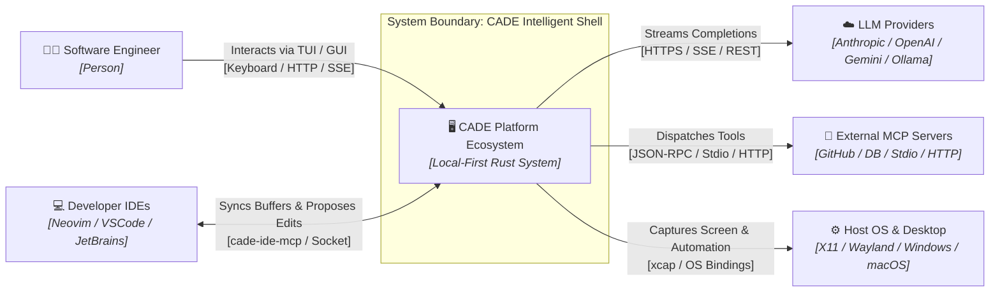
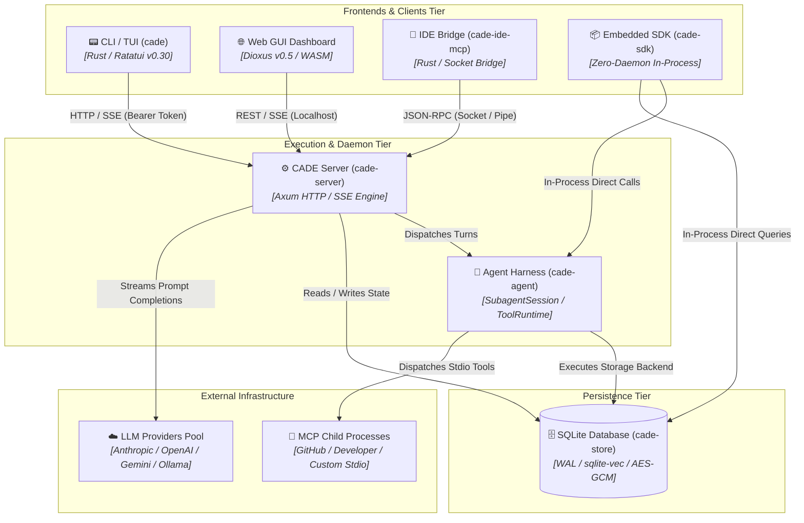
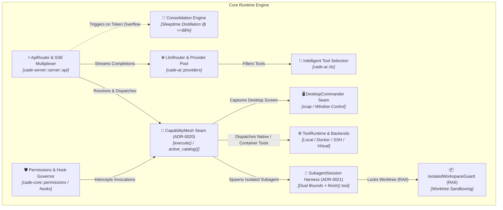

# CADE Enterprise Architecture Specification
## TOGAF 10 Framework & C4 Architecture Model Suite

[](https://www.opengroup.org/togaf)
[](https://c4model.com)
[](../../LICENSE-MIT)

---

## Table of Contents

- [1. Executive Summary & Architecture Vision (TOGAF Phase A)](#1-executive-summary--architecture-vision-togaf-phase-a)
- [2. C4 Level 1: System Context Architecture](#2-c4-level-1-system-context-architecture)
- [3. C4 Level 2: Container & Application Architecture (TOGAF Phase C)](#3-c4-level-2-container--application-architecture-togaf-phase-c)
- [4. C4 Level 3: Component & Deep Module Architecture (TOGAF Phase C/D)](#4-c4-level-3-component--deep-module-architecture-togaf-phase-cd)
- [5. Data Architecture & 3-Tier Memory Model (TOGAF Phase C - Data)](#5-data-architecture--3-tier-memory-model-togaf-phase-c---data)
- [6. Technology, Sandboxing & Security Governance (TOGAF Phase D & G)](#6-technology-sandboxing--security-governance-togaf-phase-d--g)
- [7. Architectural Decision Records (ADR) Traceability Matrix](#7-architectural-decision-records-adr-traceability-matrix)
- [8. Native Draw.io Architectural Artifacts Catalog](#8-native-drawio-architectural-artifacts-catalog)

---

## 1. Executive Summary & Architecture Vision (TOGAF Phase A)

### 1.1 Business Mission & Strategic Goals
CADE (Coding AI-Assistant with Desktop Extensions) provides a local-first, zero-cloud-lock-in intelligent developer environment and autonomous agent harness. It bridges interactive terminal user interfaces (TUI), native operating system automation, multi-model LLM routing, and external Model Context Protocol (MCP) integrations within an acyclic, modular Cargo workspace.

### 1.2 Key Architecture Principles
1. **Local-First & Data Sovereignty**: All state, SQLite memory, encrypted provider secrets, and execution environments reside strictly on the user's host machine.
2. **Dual-Runtime Topology**: Supports both centralized daemon operation (`cade-server` Axum HTTP/SSE) and zero-daemon in-process integration (`cade-sdk` `EmbeddedSession`).
3. **Seam Discipline & Deep Modules**: High leverage sits behind small public interfaces (`CapabilityMesh`, `SubagentSession`, `ToolRuntime`, `DesktopCommander`).
4. **Resilience & Governance**: Dual bounds (`max_turns`, `max_tokens_budget`), RAII temporary worktree sandboxing (`IsolatedWorkspaceGuard`), and explicit permission modes (`default`, `acceptEdits`, `plan`).

---

## 2. C4 Level 1: System Context Architecture

The **System Context** view establishes the boundary of the CADE platform, defining the primary actors, external dependencies, and integration protocols.

### 2.1 Context Diagram (Mermaid Representation)



### 2.2 System Actors & Dependencies

| Entity | Type | Responsibility & Protocol |
|---|---|---|
| **Software Engineer** | Person | Primary user interacting via the interactive TUI (`cade`), web GUI dashboard (`/dashboard`), or headless CI mode (`cade -p`). |
| **Developer IDEs** | External Environment | Editors connected via `cade-ide-mcp` (e.g. `cade.nvim`), supporting ghost-text completions, AST hover actions, and selection sync. |
| **CADE Platform** | Main System | Local-first autonomous agent system managing memory, permissions, tool execution, and multi-agent coordination. |
| **LLM Providers** | External System | Remote APIs (Anthropic, OpenAI, Gemini, OpenRouter) and local inference servers (Ollama) providing completions. |
| **MCP Servers** | External System | Model Context Protocol servers communicating over standard input/output (stdio) or HTTP. |
| **Host OS & Desktop** | Host Subsystem | Local filesystem, git tree, desktop window manager, and notification bus. |

📁 **Native Draw.io Artifact**: [`diagrams/c4-level1-system-context.drawio`](diagrams/c4-level1-system-context.drawio)

---

## 3. C4 Level 2: Container & Application Architecture (TOGAF Phase C)

The **Container Architecture** view defines the high-level executable applications, storage engines, and internal communication protocols within the CADE boundary.

### 3.1 Container Diagram (Mermaid Representation)



### 3.2 Container Responsibilities & Technology Stack

| Container | Technology Stack | Primary Responsibilities |
|---|---|---|
| **`cade` (CLI/TUI)** | Rust, `ratatui` v0.30, `crossterm` | Terminal frontend providing CSI 2026 synchronized rendering, interactive slash commands (`/model`, `/memory`, `/plan`), and fuzzy file autocomplete. |
| **`cade-gui` (Dashboard)** | Rust, `dioxus` v0.5, WASM | Browser dashboard served at `/dashboard` providing `Cmd+K` command palette, Multi-Model Arena throughput matrix, Swarm DAG canvas, and 3-tier memory heatmap. |
| **`cade-server`** | Rust, `axum` v0.8, `tokio` | Central daemon hosting REST/SSE endpoints (`/v1/agents`, `/v1/messages/stream`), Sleeptime memory consolidation, and provider connection pooling. |
| **`cade-sdk`** | Rust Library | Zero-daemon in-process runtime (`EmbeddedSession`, `TeamSession`) linking directly to SQLite and LLM routing without background server overhead. |
| **`cade-agent`** | Rust, `process-wrap` | Subagent execution harness (`SubagentSession`), RAII `IsolatedWorkspaceGuard` worktree sandboxing, and backend executors (`Local`, `Docker`, `SSH`, `Virtual`). |
| **`cade-store`** | Rust, `rusqlite` v0.39, `r2d2`, `sqlite-vec` | Local database management with `PRAGMA busy_timeout = 5000;`, AES-GCM encrypted provider secrets, knowledge graph triples, and vector similarity indexes. |

📁 **Native Draw.io Artifact**: [`diagrams/c4-level2-containers.drawio`](diagrams/c4-level2-containers.drawio)

---

## 4. C4 Level 3: Component & Deep Module Architecture (TOGAF Phase C/D)

The **Component Architecture** view zooms inside the core execution runtime (`cade-server` and `cade-agent`), detailing the deep module seams that provide leverage, locality, and strict testability.

### 4.1 Component Diagram (Mermaid Representation)



### 4.2 Deep Module Seams & Invariants

#### A. CapabilityMesh Seam (`cade-core::capabilities::mesh` - ADR-0020)
- **Interface**: Exposes exactly two methods: `execute(name, params) -> Result<ToolOutput, MeshError>` and `active_catalog() -> Vec<ToolSchema>`.
- **Implementation**: Unifies three capability sources—Native Rust tools, external MCP child processes, and markdown procedural skills. Encapsulates schema injection, tag decoration (`["cade"]`, `["mcp"]`), and timeout enforcement.

#### B. SubagentSession Harness (`cade-agent::subagents::session` - ADR-0021)
- **Interface**: `SubagentSession::run(task, budget) -> Result<SubagentOutcome, SubagentError>`.
- **Implementation**: Decoupled autonomous runner with canonical `finish(status, summary)` tool injection, strict dual bounds (`max_turns` and `max_tokens_budget`), and asynchronous telemetry streaming (`SubagentEventEmitter`).

#### C. IsolatedWorkspaceGuard (`cade-agent::subagents::workspace`)
- **Seam**: RAII lifecycle manager creating ephemeral git worktrees. On drop, uncommitted changes rollback automatically without polluting the user's working tree; on successful completion, changes merge atomically.

📁 **Native Draw.io Artifact**: [`diagrams/c4-level3-components.drawio`](diagrams/c4-level3-components.drawio)

---

## 5. Data Architecture & 3-Tier Memory Model (TOGAF Phase C - Data)

CADE structures persistent intelligence across three distinct lifecycle tiers to achieve maximum context efficiency:

```
┌──────────────────────────────────────────────────────────────┐
│ LLM Context Window Budget (128k - 1M Tokens)                 │
│                                                              │
│  1. Pinned Tier (Always Present in System Prompt)            │
│     [project] constitutions, [persona], core rules           │
│                                                              │
│  2. Short-Term Tier (Active Sliding History)                 │
│     Recent user/assistant turns, tool outputs, active_goal   │
│                                                              │
│  3. Long-Term Tier (Archival Storage)                        │
│     Historical facts, code snippets, large logs              │
│     (Promoted dynamically via Hybrid Vector + BM25 Search)   │
└──────────────────────────────────────────────────────────────┘
```

### 5.1 Relational Schema & Knowledge Graph (`cade-store`)

- **Relational Tables**:
  - `agents`: Identity, model configuration, system prompt, and parent/subagent relationships.
  - `conversations` & `messages`: Threaded conversation turns with timestamps and metadata.
  - `memory_blocks`: Labeled memory items with tier assignment (`pinned`, `short`, `long`).
  - `knowledge_edges`: Structured knowledge graph triples (`entity`, `relation`, `target`) with binary vector embeddings (Migration 16).
  - `providers`: Encrypted API keys and custom endpoint configurations (AES-GCM encryption).
- **Vector & Full-Text Search**:
  - `sqlite-vec`: Local vector similarity search using cosine distance on embedding columns.
  - `FTS5`: BM25 full-text indexing for fast, deterministic keyword matching.
- **Concurrency & Resilience**:
  - `PRAGMA journal_mode = WAL;`
  - `PRAGMA busy_timeout = 5000;` (Queues concurrent read/write queries safely for up to 5 seconds).

---

## 6. Technology, Sandboxing & Security Governance (TOGAF Phase D & G)

### 6.1 Security & Permission Governance
CADE enforces a strict zero-trust consent model across all tool executions:

```
┌─────────────────────────────────────────────────────────────┐
│ Tool Invocation Request (Mesh.execute)                      │
└──────────────────────────────┬──────────────────────────────┘
                               │
                ┌──────────────▼──────────────┐
                │ PermissionManager Check     │
                └──────────────┬──────────────┘
                               │
        ┌──────────────────────┼──────────────────────┐
        ▼                      ▼                      ▼
[Default Mode]          [AcceptEdits Mode]     [PlanOnly Mode]
Asks before write/exec  Auto-approves edits    Blocks all mutations
```

- **Granular RBAC Path Protection**: The `allowed_paths` configuration restricts file reading, writing, and grep operations to explicitly whitelisted project subdirectories.
- **Hook Policy Interception**: Shell hooks run before (`PreToolUse`) and after (`PostToolUse`) tool calls. Any non-zero exit code blocks execution and returns the stderr reason to the agent loop.

### 6.2 Execution Sandboxing Backends

1. **Local Backend (`LocalBackend`)**: Standard native process spawning on the host machine.
2. **Virtual Sandbox (`VirtualSandboxBackend`)**: Enforces path canonicalization within project bounds and sanitizes environment variables.
3. **Docker Backend (`DockerBackend`)**: Spawns ephemeral containers with isolated network and storage volumes.
4. **Firecracker MicroVM Hypervisor (ADR-0014)**: Microsecond hardware-isolated subagent sandboxing with ephemeral rootfs overlays and vsock IPC.

---

## 7. Architectural Decision Records (ADR) Traceability Matrix

| ADR # | Architectural Title | Key Decision & Implementation Impact |
|---|---|---|
| **ADR-0001** | In-Memory API Key Storage | Store provider keys encrypted in memory and SQLite via AES-GCM; never expose plaintext tokens in logs or responses. |
| **ADR-0002** | SQLite Unified Knowledge Graph | Centralize structured triple facts in `knowledge_edges` with binary vector embeddings. |
| **ADR-0003** | Direct WAL & Busy Timeout | Configure `PRAGMA busy_timeout = 5000;` to eliminate database locked errors during concurrent subagent runs. |
| **ADR-0004** | Adaptive Memory Retention & Archiving | Automatically demote idle memory blocks (>80 turns) to long-term tier to prevent context overflow. |
| **ADR-0014** | MicroVM Hypervisor Sandboxing | Support lightweight Firecracker MicroVM execution backends for untrusted tool code. |
| **ADR-0015** | Multi-Agent Team Coordination | Implement `TeamSession` with declarative supervisor/worker hierarchy and intercom messaging. |
| **ADR-0020** | CapabilityMesh Unified Seam | Unify Native Tools, MCP Processes, and Skills behind a single `execute()` / `active_catalog()` trait seam. |
| **ADR-0021** | SubagentSession Autonomous Harness | Decouple autonomous subagent execution with canonical `finish()` tool and strict dual bounds. |
| **ADR-0022** | GUI Zero-Placeholder Contract | Enforce zero-stub, fully functional reactive WASM components across all 13 dashboard views. |

---

## 8. Native Draw.io Architectural Artifacts Catalog

All architecture diagrams are authored in native, uncompressed mxGraph XML format and can be directly opened in [Draw.io / diagrams.net](https://app.diagrams.net):

| Diagram Title | C4 Level / TOGAF View | Native Draw.io File Path |
|---|---|---|
| **System Context Diagram** | C4 Level 1 / TOGAF Phase A | [`diagrams/c4-level1-system-context.drawio`](diagrams/c4-level1-system-context.drawio) |
| **Container Architecture** | C4 Level 2 / TOGAF Phase C | [`diagrams/c4-level2-containers.drawio`](diagrams/c4-level2-containers.drawio) |
| **Component Architecture** | C4 Level 3 / TOGAF Phase C/D | [`diagrams/c4-level3-components.drawio`](diagrams/c4-level3-components.drawio) |

