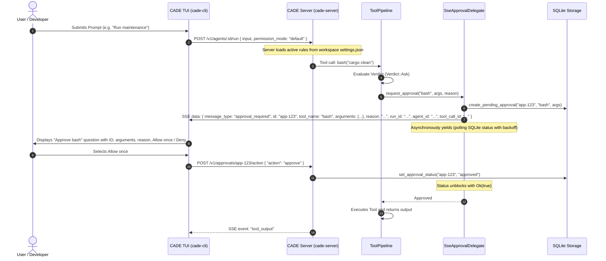
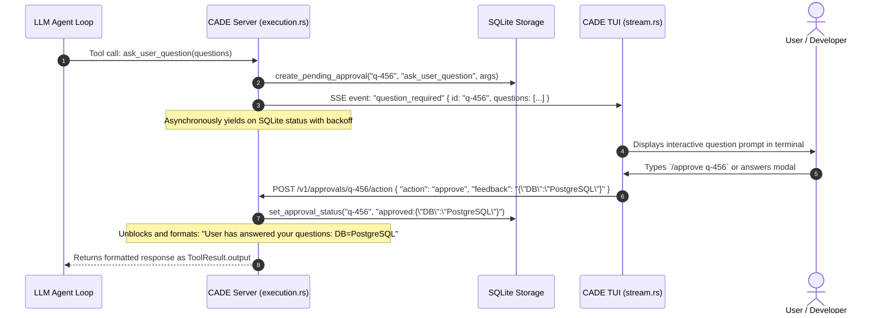

# Permissions and Interactive Approvals

CADE asks before running tools. The permission system controls **whether**
to ask, **how interactive approvals flow across the client/server seam**, and **what's permanently protected** even when approvals are bypassed.

## Client/Server Approval Architecture

In CADE's client/server architecture, tool execution takes place on `cade-server` while interaction happens in `cade-cli` (the TUI) or `cade-gui`. Approvals are managed through an asynchronous streaming yield seam:



### Interactive Question Seam (`ask_user_question`)

When the model requires human steering, disambiguation, or architecture decisions, it calls `ask_user_question`. This pauses the server turn loop and prompts the user directly:



## Modes

Lives in `cade-core::permissions::PermissionMode`. Cycle with `/mode <name>`,
or shortcut commands:

| Mode | Internal name | Icon | Behaviour |
| --- | --- | --- | --- |
| **Safe** | `default` | ✅ | All tool calls require approval |
| **Edit freely** | `acceptEdits` | 📝 | File edits auto-approved; other tools ask |
| **Plan only** | `plan` | 📖 | Read-only — state-mutating tools are blocked |
| **Full access** | `bypassPermissions` | ⚡ | All tools auto-approved (`/yolo`) |

Aliases accepted: `safe`, `edit-freely`, `plan-only`, `full-access`,
`yolo`. Display names are user-facing; internal names appear in
`settings.json`.

## File I/O Sandboxing (Granular RBAC)

CADE agents and subagents execute tool calls through `cade_agent::tools::manager::dispatch`, which enforces path-based sandboxing when interacting with the file system (`read_file`, `write_file`, `bash`, etc.).
If an agent attempts to access a path outside of the provided `allowed_paths`, the tool dispatcher immediately rejects the request with a `[Blocked by RBAC]` error. This sandbox is strictly configurable per session and heavily enforced during subagent execution.

## Per-tool rules

```bash
/permissions                       # show current mode + rules
/approve-always <pattern>          # add a permanent allow rule
/deny-always <pattern>             # add a permanent deny rule
```

Patterns can match by tool name (e.g. `bash`) or by argument
substring. They persist into `~/.cade/settings.json` under
`permissions.always_allow` / `permissions.always_deny`.

Example:

```json
{
  "permission_mode": "default",
  "permissions": {
    "allow": [
      "Bash(cargo test)",
      "Bash(cargo build)",
      "read_file",
      "glob"
    ],
    "deny": [
      "Bash(rm:*)",
      "delete_file(*)"
    ],
    "strict_bash": false,
    "allow_agent_mode_changes": false
  }
}
```

Allow rules win over deny? **No.** Deny rules win — a deny match short-
circuits before any allow check.

## Path protection (always on, even in YOLO)

`crates/cade-core/src/permissions/rules.rs::path_is_protected` denies
**writes** to these paths regardless of mode:

- `.git/`, `.git/config`, etc.
- `.ssh/`, including any sub-path
- `.env`, `.env.local`, `.env.*`
- `~/.cade/db.key` (the SQLite encryption key)
- `.cade/db.key` and `./.cade/db.key`

**Reads** are allowed (so the agent can `cat .git/HEAD` to inspect, but
cannot `echo > .git/config`).

Bash command sniffing also flags suspicious patterns:

- `eval $PAYLOAD`
- `cat /etc/passwd`
- `cat ~/.ssh/id_rsa`
- redirects writing into protected paths

## Plan mode specifics

`/plan` enables a read-only sandbox. The full toolset is still presented
to the LLM, but state-mutating tools (any `write_*`, `edit_file`, `bash`,
`run_subagent`, etc.) return a "blocked by plan mode" error before
execution.

Use plan mode when:

- Reviewing an LLM's proposed changes before committing
- Exploring an unfamiliar codebase
- Running an agent against a production checkout

## YOLO mode

`/yolo` (alias for `bypassPermissions`) is intended for sandboxed
environments — Docker, VM, ephemeral CI runner. It auto-approves
**every** tool call but **does not** disable path protection or
suspicious-command detection.

> **Warning** — combining `/yolo` with a real working directory and a
> network-connected server is at-your-own-risk. The path protection list
> is not exhaustive (it covers credentials and CADE's own DB key, not
> arbitrary user secrets).

## Interactive Consent & Session Caching

When CADE requires confirmation (`Verdict::Ask`), it negotiates authorization through the **`SecurityAuthority`** seam (`crates/cade-core/src/permissions/authority.rs`) using rich `ConsentChoice` scopes:

| Scope | Choice | Behaviour |
| --- | --- | --- |
| **Once** | `ConsentChoice::AllowOnce` | Grants permission for this single execution turn only. |
| **Session** | `ConsentChoice::AllowSession` | Grants permission and registers an in-memory rule into `PermissionManager` via `add_session_allow()`. Subsequent turns in the session resolve in $O(1)$ time without prompting. |
| **Permanent** | `ConsentChoice::AlwaysAllow` | Persists an allow rule permanently to `~/.cade/settings.json`. |
| **Deny** | `ConsentChoice::Deny` | Rejects the tool call with structured diagnostic feedback (with optional human redirection text). |

### Session Consent Invalidation on Disconnect
To prevent stale permissions from being exploited across crashed or replaced processes:
- When an MCP server drops its pipe or disconnects, `PermissionManager::remove_session_allows_for_prefix(&prefix)` purges all cached allow rules for tools under that namespace (e.g. `github__` or `serena__`).
- Reconnected or restarted servers require fresh user confirmation.

## Programmatic access

The Rust API is in `crates/cade-core/src/permissions/`:

```rust
let mgr = PermissionManager::new(PermissionMode::Default);
let outcome = mgr.resolve("write_file", &args, /*is_tool_for_review=*/false);
match outcome {
    Outcome::Allow => /* run */,
    Outcome::Deny  => /* refuse */,
    Outcome::Ask   => /* prompt user */,
}
```

Tests in `crates/cade-core/src/permissions/tests.rs` verify path
protection, suspicious-bash detection, and granular allow/deny rules.

## Practical Scenarios & Usage Examples

### Scenario 1: Authorizing a Sensitive Tool Call in the Terminal
When the agent requests to execute a potentially destructive tool (e.g. `bash` or `write_file` in Safe mode):
```text
╭─ Permission Request: bash ──────────────────────────────────────────────────╮
│ Command: cargo test --all                                                   │
│ [Allow once]  [Deny]                                                       │
╰─────────────────────────────────────────────────────────────────────────────╯
```
- **Allow once** approves this single tool call through the approval action endpoint.
- **Deny** rejects execution and returns a permission-denied tool result.
- Session and permanent grants are not offered by the streamed terminal prompt.

### Scenario 2: Rejecting with Constructive Redirection (`/deny <id> [feedback]`)
When an autonomous background subagent requests a risky tool call:
```bash
# Deny the tool call while providing redirection instructions:
/deny app-0912 Do not rewrite the entire file; use edit_file to patch only the broken function.
```
CADE delivers your instructions directly into the subagent's active context as a system intervention message. The subagent revises its plan immediately without terminating the task.

### Scenario 3: Granular File I/O Sandboxing (RBAC allowed_paths)
Restrict a specialist worker to a frontend directory:
```json
{
  "execution": {
    "backend": "local"
  },
  "permissions": {
    "allowed_paths": [
      "crates/cade-gui/src",
      "crates/cade-gui/dist"
    ]
  }
}
```
If the agent attempts to run `read_file(path="crates/cade-server/src/main.rs")`, the dispatcher rejects the call with `[Blocked by RBAC: Path outside allowed_paths]`.

### Scenario 4: Managing Approvals in the Web Dashboard
In the web dashboard (`http://localhost:8284/dashboard`):
1. Navigate to **Tools & Approvals ➔ Security Approvals**.
2. If subagents request authorization, a crimson **Action Required** badge illuminates.
3. Review formatted JSON arguments in a syntax-highlighted box.
4. Click **`✓ Approve`** or **`✕ Deny`** for instant zero-refresh processing.

## Plan-mode + hooks combined

A `PreToolUse` hook can supplement plan mode by blocking specific
patterns even in `default` mode. See [hooks.md](hooks.md).

## Mode Model Retention (Auto-switching LLMs per Mode)

To optimize cost and quality across different tasks, CADE automatically remembers and swaps the active LLM model when you switch between permission modes.

### Key Characteristics

- **Automatic Mapping:** When you are in a specific mode (e.g., `/plan` or `/default`) and run `/model <model_name>`, CADE automatically registers that model as your preference for the active mode.
- **Seamless Auto-Switching:** Whenever you switch modes (via `/mode`, `/plan`, `/default`, `/yolo`, or dynamically cycling with the `Tab` / `Shift-Tab` keyboard shortcuts), CADE automatically patches the backend agent, updates your active toolset, and displays a TUI notification (`🔄 Auto-switching model to ...`).
- **Restart Persistence:** Your preferred model mappings are persisted in the gitignored **Local Settings** layer (`.cade/settings.local.json`). When you restart CADE, it will automatically resolve and apply your preferred model for your startup permission mode.
