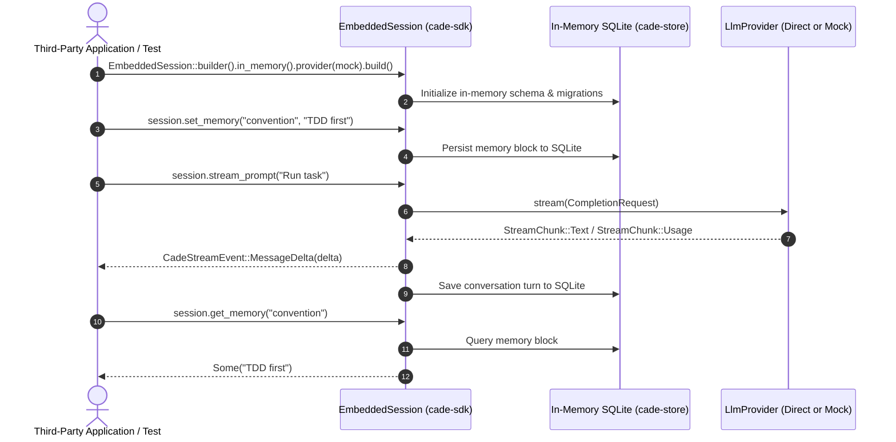

# CADE Rust SDK (`cade-sdk`)

[](https://crates.io)
[](https://docs.rs)
[](../../LICENSE-MIT)

The **CADE Rust SDK** (`cade-sdk`) provides idiomatic, production-grade Rust APIs for building AI-powered digital solutions, autonomous microservices, multi-agent swarms, and embedded agent workflows.

---

## 🚀 Two Execution Topologies

CADE SDK is uniquely designed with a **dual-runtime architecture**:

```
1. In-Process Zero-Daemon (`EmbeddedSession` / `TeamSession`):
   ┌───────────────────────────────────────────────────────────┐
   │ Your Rust Binary / CLI / Microservice / Lambda            │
   │                                                           │
   │   EmbeddedSession (`cade-sdk`)                            │
   │   ├── Direct LLM Routing (`cade-ai`)                      │
   │   ├── SQLite Memory & Knowledge Graph (`cade-store`)      │
   │   ├── Native Tool Runtime & Capability Mesh (`cade-agent`)│
   │   └── Reactive Stream (`CadeStreamEvent`)                 │
   └───────────────────────────────────────────────────────────┘
   (Zero network latency, no external daemons required)

2. Daemon Client-Server (`AgentSession` / `CadeClientSdk`):
   ┌───────────────────────┐   HTTP / SSE    ┌───────────────────────┐
   │ Your Rust Application │ ──────────────▶ │ CADE Server Daemon    │
   │ (`AgentSession`)      │ ◀────────────── │ (`cade-server` Axum)  │
   └───────────────────────┘                 └───────────────────────┘
   (Centralized memory, multi-tenant state, shared MCP processes)
```

---

## 📚 Documentation Index

| Guide | Description |
|---|---|
| **[Quickstart Guide](quickstart.md)** | Get running in 5 minutes with zero-daemon standalone scripts and server client connections. |
| **[Architecture & Deep Modules](architecture.md)** | Deep dive into execution models, the unified `CapabilityMesh`, memory tiering, and RAII isolation guards. |
| **[Solution Cookbook](cookbook.md)** | End-to-end recipes for automated code review bots, multi-agent squads, streaming web/TUI interfaces, and desktop automation. |
| **[API Reference](api-reference.md)** | Exhaustive reference for `EmbeddedSessionBuilder`, `TeamSessionBuilder`, `CadeClientSdk`, `CadeStreamEvent`, and error handling. |

---

## 📦 Installation

Add `cade-sdk` and `tokio` to your `Cargo.toml`:

```toml
[dependencies]
cade-sdk = { version = "0.2", path = "../crates/cade-sdk" }
tokio = { version = "1", features = ["full"] }
futures = "0.3"
```

---

## ⚡ In-Process Zero-Daemon Execution (`EmbeddedSession`)

Applications can run complete autonomous agent turns and streaming telemetry directly in-process with zero network latency and no external daemons (ADR-0020 & ADR-0021):



### Complete Working Rust Example

```rust
use std::sync::Arc;
use futures::StreamExt;
use cade_sdk::{EmbeddedSession, events::CadeStreamEvent};

#[tokio::main]
async fn main() -> Result<(), Box<dyn std::error::Error>> {
    // 1. Build an in-process session using in-memory SQLite (zero daemon required)
    let session = EmbeddedSession::builder()
        .in_memory()
        .agent_name("ArchitectBot")
        .model("anthropic/claude-sonnet-4-5")
        .system_prompt("You are an expert system design partner.")
        .build()
        .await?;

    // 2. Persist memory blocks directly into SQLite
    session.set_memory("convention", "Always write tests before code (TDD).").await?;

    // 3. Stream real-time telemetry deltas
    let mut stream = session.stream_prompt("Propose a deep module structure.").await?;
    while let Some(event) = stream.next().await {
        if let CadeStreamEvent::MessageDelta(delta) = event {
            print!("{delta}");
        }
    }
    println!();

    Ok(())
}
```

---

## 🛡️ Enterprise Feature Highlights

- **Zero-Daemon Embedding**: Embed a complete autonomous coding harness directly in any Rust application with zero background daemons.
- **Multi-Agent Squad Orchestration**: Programmatically dispatch specialized worker trees (`TeamSession`) with automated task decomposition, intercom messaging, and parallel fan-out.
- **Unified Capability Mesh**: Native tools, dynamic external Model Context Protocol (MCP) servers, and markdown procedural skills exposed via a single trait seam.
- **Persistent 3-Tier Memory**: Seamlessly manage pinned, short-term, and archival memory blocks with SQLite and hybrid semantic vector search.
- **Granular RBAC & Sandboxing**: Restrict execution to specific directory trees via `allowed_paths` or spin up ephemeral git worktrees with automatic atomic merge and rollback.
